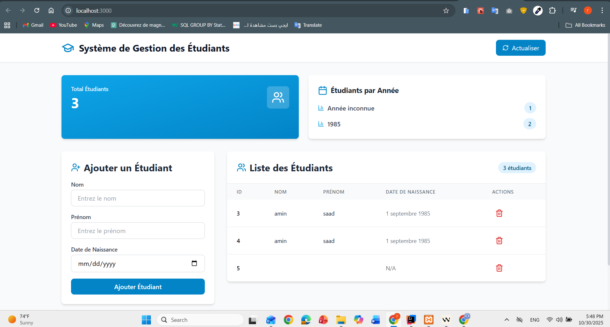

# 💼 Compte Client - Client Account Management System



A modern web application for managing client bank accounts, built with **React** and **Bootstrap**. This application provides an intuitive interface to create and view client accounts with real-time data synchronization.

## 📋 Table of Contents

- [Features](#features)
- [Technologies Used](#technologies-used)
- [Project Structure](#project-structure)
- [Installation](#installation)
- [Available Scripts](#available-scripts)
- [Configuration](#configuration)
- [API Integration](#api-integration)
- [Components Overview](#components-overview)

## ✨ Features

- **Add New Accounts**: Create bank accounts with initial balance, creation date, and account type (Current or Savings)
- **View Account List**: Display all accounts in a clean, organized table format
- **Real-time Updates**: Automatic synchronization with the backend API
- **Responsive Design**: Mobile-friendly interface using Bootstrap 5
- **Type Selection**: Support for two account types - "Courant" (Current) and "Épargne" (Savings)
- **Form Validation**: Client-side validation for data integrity

## 🛠 Technologies Used

| Technology | Version | Purpose |
|------------|---------|---------|
| **React** | 19.2.0 | Frontend framework for building the UI |
| **Bootstrap** | 5.3.8 | CSS framework for responsive design |
| **Axios** | 1.13.1 | HTTP client for API communication |
| **React DOM** | 19.2.0 | React rendering for web applications |
| **React Scripts** | 5.0.1 | Build and development tools |

## 📁 Project Structure

```
compte-client/
│
├── public/                 # Static files
├── src/
│   ├── components/
│   │   ├── CompteForm.js   # Account creation form component
│   │   └── CompteList.js   # Account list display component
│   ├── App.js             # Main application component
│   ├── App.css            # Application styles
│   ├── config.js          # API configuration
│   └── index.js           # Application entry point
│
├── images/                 # Documentation images
│   └── react.png          # React logo
│
├── package.json           # Project dependencies
└── README.md             # Project documentation
```

## 🚀 Installation

### Prerequisites
- **Node.js** (version 14 or higher)
- **npm** (Node Package Manager)
- Backend API server running (for full functionality)

### Steps

1. **Clone the repository**
   ```bash
   git clone <repository-url>
   cd compte-client
   ```

2. **Install dependencies**
   ```bash
   npm install
   ```

3. **Configure the API endpoint**
   
   Edit `src/config.js` to point to your backend API:
   ```javascript
   const API_BASE_URL = 'http://localhost:8080/api';
   export default API_BASE_URL;
   ```

4. **Start the development server**
   ```bash
   npm start
   ```

5. **Open in browser**
   
   Navigate to [http://localhost:3000](http://localhost:3000)

## 📜 Available Scripts

### `npm start`

Runs the app in **development mode**.
- Opens automatically at [http://localhost:3000](http://localhost:3000)
- Hot reload enabled - the page updates when you make changes
- Lint errors appear in the console

### `npm test`

Launches the **test runner** in interactive watch mode.
- Runs all test files
- Re-runs tests automatically when files change
- See the [testing documentation](https://facebook.github.io/create-react-app/docs/running-tests) for more information

### `npm run build`

Creates a **production build** in the `build/` folder.
- Optimizes React for best performance
- Minifies code and includes hashes in filenames
- Ready for deployment to a web server
- See the [deployment guide](https://facebook.github.io/create-react-app/docs/deployment) for more information

### `npm run eject`

⚠️ **Warning: This is a one-way operation!**

Ejects the app from Create React App configuration, giving you full control over:
- Webpack configuration
- Babel setup
- ESLint rules
- All build dependencies

**Only use if you need advanced customization!**

## ⚙️ Configuration

### API Configuration

The application connects to a backend API defined in `src/config.js`:

```javascript
const API_BASE_URL = 'http://localhost:8080/api';
export default API_BASE_URL;
```

**Endpoints used:**
- `POST /comptes` - Create a new account
- `GET /comptes` - Retrieve all accounts

### Environment Variables

You can create a `.env` file in the root directory for environment-specific configurations:

```env
REACT_APP_API_URL=http://localhost:8080/api
```

## 🔌 API Integration

### Account Object Structure

```json
{
  "id": 1,
  "solde": 5000.00,
  "dateCreation": "2024-10-31",
  "type": "COURANT"
}
```

### Account Types
- **COURANT**: Current/Checking account
- **EPARGNE**: Savings account

## 🧩 Components Overview

### CompteForm Component
**Purpose**: Provides a form interface for creating new accounts

**Features:**
- State management using React hooks (`useState`)
- Form validation
- HTTP POST request to backend API
- Success/error notifications
- Bootstrap styling for responsive design

**Key Functions:**
- `handleChange()`: Updates form state on input changes
- `handleSubmit()`: Processes form submission and sends data to API

### CompteList Component
**Purpose**: Displays all accounts in a table format

**Features:**
- Fetches data on component mount using `useEffect`
- Dynamic table rendering with `map()`
- Responsive table design with Bootstrap
- Real-time data display

**Key Functions:**
- `useEffect()`: Loads accounts from API when component mounts
- `setComptes()`: Updates component state with fetched data

## 🎨 Styling

The application uses **Bootstrap 5.3.8** for styling:
- Responsive grid system
- Pre-styled form controls (`form-control`, `form-select`)
- Button styles (`btn`, `btn-primary`)
- Table styles (`table`, `table-bordered`)
- Spacing utilities (`mt-4`, `mb-3`)

## 🐛 Troubleshooting

### Common Issues

**Problem**: API connection errors
- **Solution**: Verify backend server is running and API_BASE_URL is correct

**Problem**: Accounts not displaying
- **Solution**: Check browser console for errors, verify API endpoint returns valid JSON

**Problem**: npm start fails
- **Solution**: Delete `node_modules` and `package-lock.json`, then run `npm install` again

## 📚 Learn More

- [Create React App Documentation](https://facebook.github.io/create-react-app/docs/getting-started)
- [React Official Documentation](https://reactjs.org/)
- [Bootstrap 5 Documentation](https://getbootstrap.com/docs/5.3/)
- [Axios Documentation](https://axios-http.com/docs/intro)

## 📝 License

This project was bootstrapped with [Create React App](https://github.com/facebook/create-react-app).

---

**Made with ❤️ using React and Bootstrap**
